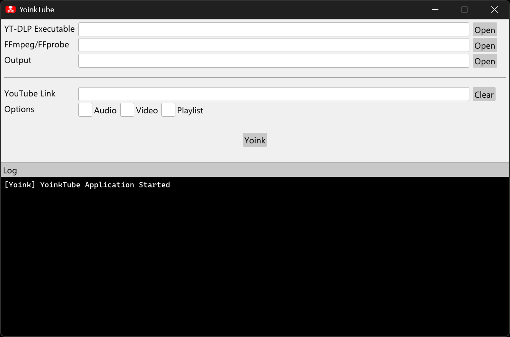
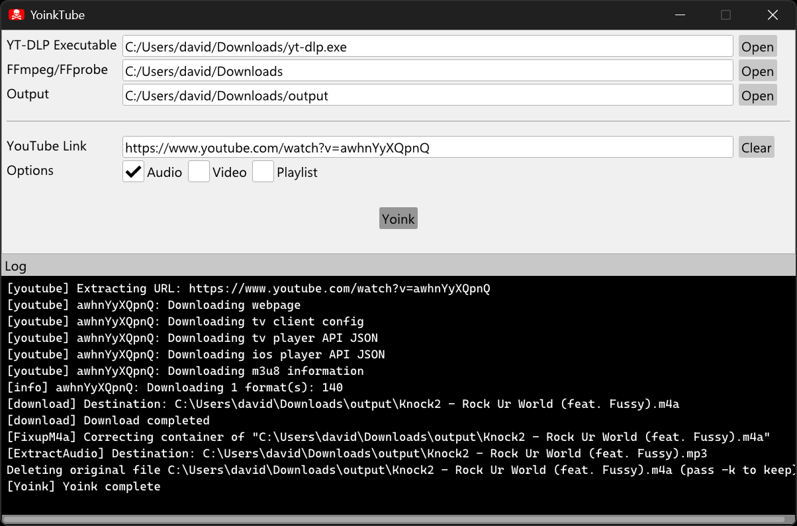

# YoinkTube

A small simple GUI wrapper for yt-dlp.
This project was created in C++17 and is only known to work on Windows 11.

## Usage

- Download the latest version [here](https://github.com/dadams05/YoinkTube/releases). Extract the zip to wherever you want. In order for this program to work right, you will need to download 3 more applications:
	
	- [FFmpeg and FFprobe](https://github.com/yt-dlp/FFmpeg-Builds/releases) (if on Windows 11 look for *latest-win64-gpl*)
	- [yt-dlp](https://github.com/yt-dlp/yt-dlp/releases)

- Put the three executable (.exe) files in the same folder as YoinkTube.exe
- Run YoinkTube and set the paths to the correct locations that you chose
- Put in the YouTube link
- Select **Audio** for audio files, **Video** for video files, and **Playlist** if you put in a playlist link. You can do any matchup of these options.
- Hit **Yoink**

### Notes

- The program does not check if the youtube link put in is valid or not
- When trying to download a playlist, put in the actual link of the playlist, not a link of one of the videos that is in the playlist. Example:
	- Wrong -> https://www.youtube.com/watch?v=awhnYyXQpnQ&list=PL9KOTjOvdEji-iVaOvjr6crQGeWBllYoT&index=33
	- Correct -> https://www.youtube.com/playlist?list=PL9KOTjOvdEji-iVaOvjr6crQGeWBllYoT
- This program has not been tested on Windows 10 or Linux

## Screenshots

## Credits

- [SDL3](https://github.com/libsdl-org/SDL)
- [Dear ImGui](https://github.com/ocornut/imgui)
- [tinyfiledialogs](https://sourceforge.net/projects/tinyfiledialogs/)
- [yt-dlp](https://github.com/yt-dlp/yt-dlp)
- [FFmpeg/FFprobe](https://ffmpeg.org/)
